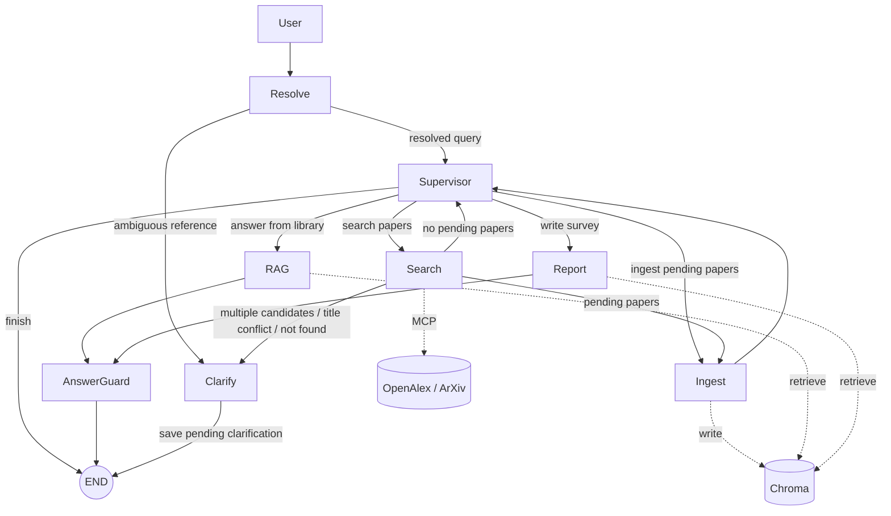
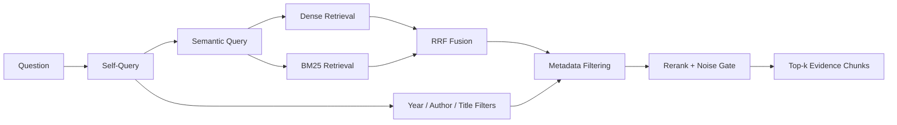

# paper-guide

面向 AI 研究者的 LangGraph 多智能体文献检索、PDF 入库、RAG 问答与综述生成系统。

`paper-guide` 将论文搜索、PDF 解析、向量入库、混合检索、带引用回答、综述生成和人工确认串成一个可恢复的本地研究助手。项目重点不只是“调用大模型回答问题”，而是围绕学术文献场景处理多轮指代、工具检索、证据约束、审批恢复、长期记忆和评测回归等工程问题。

## Highlights

- **LangGraph 多智能体工作流**：Resolve、Supervisor、Search、Ingest、RAG、Report、Verify、Clarify 节点分工明确，状态转移由代码控制。
- **论文搜索与入库闭环**：支持 arXiv ID、URL、精确标题和研究主题；接入 OpenAlex 与 ArXiv MCP；搜索结果可确认后入库。
- **版面感知 PDF 解析**：基于 PyMuPDF 提取正文、表格 Markdown、图注、页码、bbox、xref 和正文引用关系。
- **混合 RAG 检索**：Self-Query、Dense、BM25、RRF、元数据过滤与可选 Rerank 组成完整召回管线。
- **AnswerGuard 证据闸门**：回答生成后检查引用标题、证据编号、上下文充分性和无支撑断言，尽量避免把草稿直接暴露给用户。
- **可恢复 HITL 与记忆系统**：入库确认支持 TTL、幂等恢复、SQLite 审计；长期记忆按 `user_id` 隔离并支持开关、TTL 和清除。
- **评测闭环**：覆盖单元测试、Supervisor 路由、搜索意图、澄清判定和 RAG 检索回归。

## Why This Project Matters

| 能力点 | 项目中的体现 |
| --- | --- |
| Agent workflow engineering | 用 LangGraph 拆分节点、条件边、checkpoint 和可恢复状态，而不是把所有逻辑塞进一个 prompt。 |
| Retrieval engineering | Dense + BM25 + RRF + Rerank，支持结构化约束、降级策略和检索层评测。 |
| Reliability | 对工具返回、用户审批、PDF 下载、引用核验和澄清选择都做确定性保护。 |
| Product thinking | Web 端支持流式进度、搜索确认、本地 PDF 上传、多轮线程和用户记忆管理。 |
| Evaluation awareness | 明确区分受控评测、在线链路和真实生产效果，不伪造大规模指标。 |

## Architecture



确定性状态转移由代码控制。只有需要理解自然语言意图时才调用 LLM；明确的 arXiv ID、URL、审批选择和澄清选项尽量由规则解析，降低误判成本。

## Tech Stack

| 模块 | 实现 |
| --- | --- |
| Agent workflow | LangGraph `StateGraph` + SQLite Checkpointer |
| LLM orchestration | LangChain + OpenAI-compatible APIs |
| Structured output | Pydantic + function-calling structured output |
| Academic search | OpenAlex MCP server + ArXiv MCP client |
| Vector database | Chroma |
| Embedding | DashScope `text-embedding-v4` |
| Sparse retrieval | BM25 |
| PDF parsing | PyMuPDF |
| API | FastAPI + SSE |
| Frontend | Single-page HTML |
| Tooling | uv, pytest, Ruff |

## Quick Start

### 1. Install

项目要求 Python 3.13+ 和 `uv`。

```bash
git clone https://github.com/HZ3568/paper-guide.git
cd paper-guide
uv sync
```

### 2. Configure Environment

```bash
cp .env.example .env
```

必填配置：

```dotenv
OPENDETECT_LLM_MODEL="deepseek-chat"
OPENDETECT_LLM_BASE_URL="https://api.deepseek.com"
OPENDETECT_LLM_API_KEY="your-deepseek-api-key"

OPENDETECT_EMBED_MODEL="text-embedding-v4"
OPENDETECT_EMBED_BASE_URL="https://dashscope.aliyuncs.com/compatible-mode/v1"
OPENDETECT_EMBED_API_KEY="your-dashscope-api-key"

CHROMA_PERSIST_DIR="./data/chroma_db"
```

说明：项目已更名为 `paper-guide`，但环境变量仍保留 `OPENDETECT_*` 前缀，以兼容既有 `.env` 配置。

### 3. Run Web App

```bash
uv run uvicorn api:app --reload --host 0.0.0.0 --port 8000
```

打开 `http://localhost:8000`。

### 4. Run Checks

```bash
make test               # unit tests, no external service required
make integration-tests  # shortest online path, requires model config
make lint               # Ruff
make eval               # RAG retrieval eval
make intent-eval        # Resolve -> SearchIntent eval
make clarify-eval       # Clarify eval
make route-eval         # Supervisor routing eval
```

## Usage

### Web

Web 页面支持：

- SSE 流式对话和执行进度；
- RAG / Report token 级输出；
- 搜索结果入库前勾选确认；
- 本地 PDF 拖拽上传；
- 多轮会话和历史线程；
- 用户长期记忆查看、清除和设置。

### Python

```python
from paper_guide.graph import run

run("帮我搜索首次提出 ViT 的论文")
run("Swin Transformer 相比 ViT 做了哪些改进？")
run("帮我生成一份已有论文的综述报告")
```

多轮调用：

```python
from paper_guide.graph import chat

chat("讲讲 LoRA", thread_id="demo", user_id="user-1")
chat("好啊", thread_id="demo", user_id="user-1")
chat("还有吗", thread_id="demo", user_id="user-1")
```

本地 PDF 入库：

```python
from paper_guide.tools.rag_tool import ingest_local_pdf

result = ingest_local_pdf.invoke({
    "file_path": "papers/example.pdf",
    "title": "Example Paper",
    "authors": "A. Researcher et al.",
    "published": "2026-01-01",
})
print(result)
```

## Core Design

### Multi-Agent Workflow

- **Resolve**：每轮入口。处理省略、指代和上一轮待确认动作；明确 ID/URL 与审批选择走规则；输出 `resolved_query`，保留原始输入。
- **Supervisor**：读取状态、短期上下文和用户偏好，输出结构化 `RouteDecision`，只能路由到白名单节点。
- **Search**：识别 arXiv ID、URL、精确标题和主题查询，调用 OpenAlex 与 ArXiv；多候选或冲突时转 Clarify。
- **Ingest**：下载并解析 PDF，生成 chunk、embedding 和元数据后写入 Chroma；入库前支持 HITL 确认。
- **RAG / Report**：从论文库召回证据并生成回答或综述。
- **Verify**：对回答做引用核验和证据充分性检查。
- **Clarify**：当指代、标题候选或工具结果不唯一时反问用户，而不是猜测。

### RAG Retrieval Pipeline



- **Self-Query**：把年份、作者、标题等显式约束抽成结构化字段。
- **Hybrid Retrieval**：Dense 负责语义召回，BM25 补充缩写、论文名和专有词匹配。
- **RRF**：用倒数排名融合，不要求两种检索分数同尺度。
- **Rerank**：支持 LLM listwise、DashScope `gte-rerank` 或关闭重排。
- **Graceful Degradation**：增强环节失败时退化为更简单的检索路径。

### PDF Ingestion

入库流程关注“可检索”和“可追溯”：

- 上传和远程下载默认限制为 50 MB、200 页；
- 校验 MIME、PDF 文件头、HTTPS 白名单、重定向目标和超时；
- 正文按页提取并保留页码；
- 表格转 Markdown，保留表号、标题、页码和正文引用；
- 图片块保存图号、图注、bbox、xref、尺寸和正文引用句；
- chunk ID 确定性生成，重复写入幂等；
- 使用 `paper_id -> document_id -> chunk_id` 分层标识论文、PDF 和检索块。

### AnswerGuard

RAG 与 Report 输出不会直接进入最终答案：

- 规则层解析 `（来源：论文标题，第 N 页）`，核对标题是否来自本轮检索结果；
- LLM 读取问题、回答和召回片段，结构化判断 `grounded`、`sufficient_context`、`confidence`；
- 代码复核证据编号和字段一致性；
- 证据不足时拒答并写入可承接的搜索动作；
- 核验服务异常时保留回答可用性，但显式标记 `unavailable`。

SSE 在核验完成前只发送节点进度，不发送正文草稿；核验结束后才发送带 `verified=true` 的正文块。

### HITL, State, and Memory

| 类型 | 存储 | 隔离键 | 用途 |
| --- | --- | --- | --- |
| 短期上下文 | `messages` sliding window | `thread_id` | 多轮问答和指代消解 |
| 工作流状态 | LangGraph SQLite Checkpointer | `thread_id` | 节点状态、HITL、pending action |
| 用户偏好 | SQLite `user_profile` | `user_id` | 研究偏好、开关、TTL、来源 |
| 论文知识库 | Chroma | 当前全局共享 | 文献检索 |

长期记忆只保存提取后的偏好，不保存完整原始对话。关闭后不读取、不写入，也不触发异步提取；用户可通过 API 清除旧数据。

## Evaluation

| 命令 | 目标 | 说明 |
| --- | --- | --- |
| `make test` | 确定性逻辑和节点单元测试 | 不访问外部服务 |
| `make integration-tests` | 最短在线链路 | 需要模型配置 |
| `make eval` | Dense baseline 与完整检索管线对比 | 支持外部 JSONL |
| `make intent-eval` | arXiv 解析、Resolve、SearchIntent | 21 条 golden |
| `make clarify-eval` | 澄清信号和选择解析 | 24 条 golden |
| `make route-eval` | Supervisor 路由 `(query, state) -> next` | 17 条 golden |

受控合成评测报告 Hit、MRR、Precision、Recall、nDCG、Noise、P50/P95 延迟、平均结果数、检索侧 LLM 调用数和失败率。它用于可复现回归，不代表真实产品效果。

真实评测集使用 JSONL：

```json
{"q": "问题", "gold": ["paper-id-1", "paper-id-2"]}
```

运行：

```bash
uv run python -m paper_guide.eval.rag_eval --dataset data/eval/questions.jsonl --no-judge
```

## API

| 方法 | 路径 | 说明 |
| --- | --- | --- |
| POST | `/api/chat` | 非流式对话 |
| POST | `/api/chat/stream` | SSE 流式对话 |
| POST | `/api/chat/resume` | 恢复待处理 HITL 审批 |
| GET | `/api/approvals` | 按用户读取审批审计记录 |
| GET | `/api/threads` | 历史会话 ID |
| GET | `/api/papers` | 已入库论文 |
| POST | `/api/upload-pdf` | 上传本地 PDF |
| GET | `/api/user-profile` | 读取用户偏好 |
| DELETE | `/api/user-profile` | 清除用户偏好 |
| PATCH | `/api/user-profile/settings` | 开关长期记忆并设置 TTL |

## Project Structure

```text
paper-guide/
├── api.py
├── frontend/
│   └── index.html
├── src/paper_guide/
│   ├── graph.py
│   ├── state.py
│   ├── approval.py
│   ├── prompts.py
│   ├── context_utils.py
│   ├── user_memory.py
│   ├── agents/
│   │   ├── resolve.py
│   │   ├── supervisor.py
│   │   ├── search.py
│   │   ├── ingest.py
│   │   ├── rag.py
│   │   ├── report.py
│   │   ├── verify.py
│   │   └── clarify.py
│   ├── tools/
│   │   ├── arxiv_tool.py
│   │   ├── mcp_client.py
│   │   ├── openalex_mcp_server.py
│   │   ├── rag_tool.py
│   │   ├── retriever.py
│   │   └── progress.py
│   └── eval/
│       ├── rag_eval.py
│       ├── intent_eval.py
│       ├── clarify_eval.py
│       └── route_eval.py
├── tests/
├── Makefile
├── pyproject.toml
└── langgraph.json
```

## Known Limits

- Chroma 论文库当前是全局共享的，没有按用户隔离。
- SQLite Checkpointer 适合本地开发，不适合作为高并发生产存储。
- 当前没有用户认证，`user_id` 是隔离键而不是安全身份凭证。
- RAG 和意图评测仍是小型受控数据集。
- PDF 下载速度受 arXiv 限流和来源站点影响。
- 无边框、复杂合并单元格或跨页表格仍可能识别失败。
- 图片当前只建立 bbox、xref、图注和正文引用关联，不做像素级视觉理解。
- 扫描页暂不做 OCR。

## Roadmap

- 为检索结果保留统一相关性分数，再评估 `low_relevance` 澄清；
- 将 checkpoint 中的复杂对象迁移为稳定的可序列化结构；
- 扩充真实标注意图和检索评测集；
- 将 MCP 调用迁移为真正的异步生命周期；
- 增加跨页表格合并、扫描页 OCR 和按需图片视觉理解；
- 生产环境使用 Postgres / Redis Checkpointer、对象存储和更严格的认证授权。
